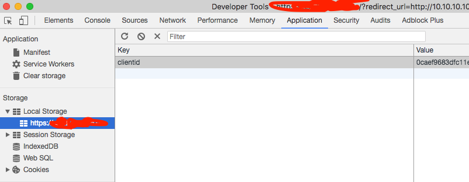

使用说明：
------
1、git clone或直接下载ZIP文件后解压。

2、打开chrome扩展程序页面或直接在地址栏输入chrome://extensions并回车。

3、选中"开发者模式"，点击"加载已解压的扩展程序"按钮，选择HBHelper项目文件夹。

4、最后将钉钉中发到每个人独立的二维码保存为文件（不能保存可以截图），进入sso页面，点击配置按钮，选择保存的二维码文件即可。

更新说明：
------
1、git pull拉取最新代码 或 重新下载ZIP包。

2、打开chrome扩展程序页面 或 直接在地址栏输入chrome://extensions并回车。

3、点击刷新HBHelper扩展程序。若无效，可以删除插件后重新加载已解压的扩展程序。

4、若进入sso时显示的是“当前已登陆账号”界面，再点击“切换到账号密码登陆”按钮时，会无法正常展示身份宝验证码。

目前的解决方案有三种：
一，在页面显示后尽快点击“切换到账号密码登陆”按钮。
二，右键点击“检查”，点击顶部Application，点击Local Storage, 删除sso域名下的clientId。
三、彻底清除浏览器缓存。

